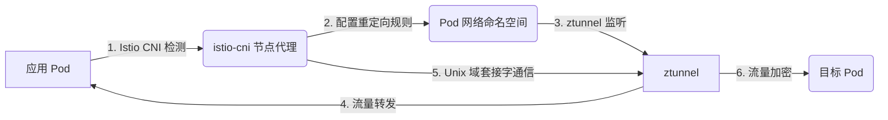

# Istio Ambient Mesh 流量劫持原理解析

## 1. 引言

Istio Ambient Mesh 是一种无需 Sidecar 的新型服务网格模式，旨在提供兼容性更广、资源占用更低的流量管理方案。流量劫持是 Ambient Mesh 的核心特性之一，它允许 Istio 在不修改应用代码的前提下控制和监控微服务之间的网络流量。

## 2. Ambient Mesh 的流量劫持挑战

Istio Ambient Mesh 的早期版本依赖于在宿主机网络命名空间中透明地重定向工作负载 Pod 之间的流量到 ztunnel。然而，这种方法与多种第三方 CNI 实现有冲突，限制了 Ambient Mesh 在不同 Kubernetes 平台和 CNI 实施上的兼容性。

## 3. 解决兼容性问题的创新方案

为了解决上述挑战，Istio 社区引入了一种创新的流量重定向机制，称为 **in-Pod 流量重定向**。这种方法允许 ztunnel 在 Pod 的网络命名空间内启动其重定向套接字，同时自身运行在系统命名空间之外。

### 3.1 技术实现

- **istio-cni 组件**：作为 Ambient Mesh 必需的组件，它不是主 CNI 实现，而是扩展了集群中已存在的主 CNI 实现。
- **网络命名空间套接字**：利用 Linux 套接字 API 的能力，允许一个在某个网络命名空间中运行的进程创建并拥有另一个网络命名空间内的监听套接字。
- **Unix 域套接字**：`istio-cni` 节点代理通过 Unix 域套接字通知节点上的 ztunnel 建立本地代理监听端口。

## 4. 新模型的优势

- **兼容性**：新模型在 Pod 的网络命名空间内进行所有流量捕获和重定向，对节点、CNI 和其他组件来说，看起来就像 Pod 内部有一个 Sidecar 代理，即使实际上 Pod 内部没有运行任何 Sidecar 代理。
- **网络策略执行**：由任何 Kubernetes 主 CNI 强制执行和管理，无论 CNI 是否使用 eBPF 或 iptables，都不会产生冲突。
- **加密流量**：在 Ambient Mesh 中，进出 Pod 的流量默认使用 mTLS 加密，增强了安全性。

## 5. 架构图

以下是 Istio Ambient Mesh 中新的 in-Pod 流量重定向机制的架构图：

## 6. 结论

Istio Ambient Mesh 的 in-Pod 流量重定向模型是一个重要的创新，它显著提高了与所有主要云提供商和 CNI 的兼容性。该特性已合并到 Istio 1.21 并默认启用，允许用户在任何 Kubernetes 平台上运行 Ambient Mesh，无论他们选择或现有的 CNI 实现是什么。

## 7. 参考文献

- [Maturing Istio Ambient: Compatibility Across Various Kubernetes Providers and CNIs](https://istio.io/latest/blog/2024/inpod-traffic-redirection-ambient/)

通过这种新方法，Istio Ambient Mesh 能够更好地融入多样化的 Kubernetes 生态系统，为用户提供了更大的灵活性和更广泛的选择，同时保持了 Istio 的安全和流量管理能力。
